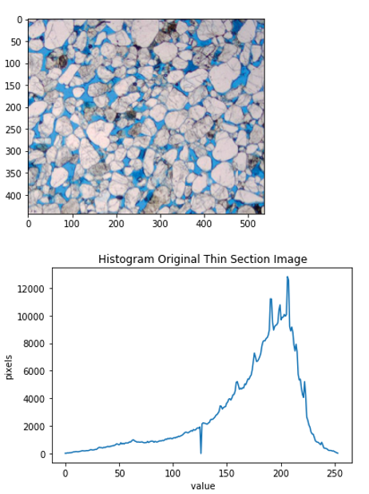

# Create-Labels-for-Thin-Sections
Create Labels for Keras image-segmentation:

This is meant to document the steps being used to create a labeled image that will be used for the training for the image segmentation process using Keras per Divam Gupta's GitHub repository. 

We are trying to label different types of grains or blue dye epoxy (this represents visual porosity) observed in clastic petrographic thin sections. The following image is an example of a typical clastic thin section that we are working with for our test data:

We read in the original Thin Section image and create a Numpy array. 

    TS_Im = Image.open(img)
    
    data = np.array(TS_Im) 

We then convert the color image to a gray-level image using the following code:

    gradient = gaussian(rgb2gray(data)) 

using skimage filter gaussian (or median) filters and skimage rgb2gray. 

The following is an example of the gray-level image and histogram of these data scaled 0 to 1.  

We then partition the gray-level image data into different bins which will serve as our annotated image labels:

 
    label = np.zeros(gradient.shape )

    label[gradient < 0.25] = 1 #black grains 
    label[gradient > 0.25] = 2 #blue dye epoxy 
    label[gradient > 0.4]  = 3 #darker grains- dark orange   
    label[gradient > 0.6]  = 4 #darker portions of bright grain, edges - orange  
    label[gradient > 0.8]  = 5 #bright grains - Yellow   

We are labeling our data from 1 to 5 to represent the key segments observed in the image. These labeled images will be used as the annotated images for our image segmentation training. 

The above histogram verifies that we have labeled 5 different segments or objects in our image.

