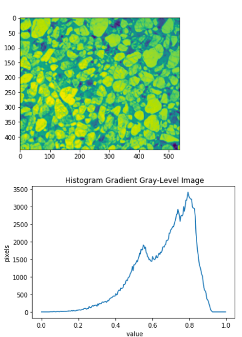
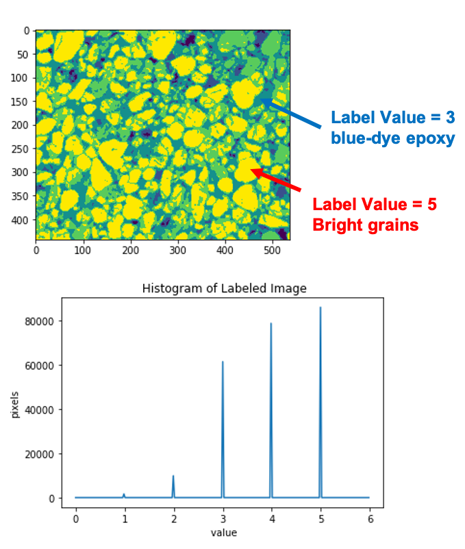
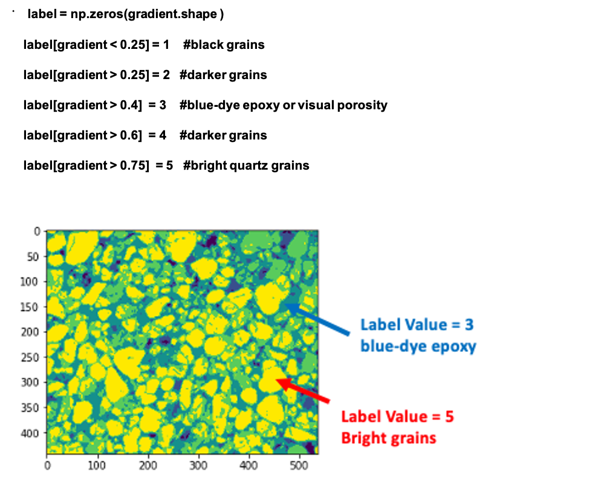

# Create-Thin-Section-Labels
Create Labels for Thin Sections for image-segmentation-keras:

This repository is meant to document the steps being employed to create a labeled Thin Section image for the image segmentation using Keras per Divam Gupta's GitHub repository. 

## Objective
The objective of this repository is to label different types of grains or blue dye epoxy (which represents visual porosity) observed in clastic petrographic thin sections of rock samples. The following image is an example of a typical clastic rock thin section and the histogram of the pixel values:

## Load Image
We read in the original Thin Section image and create a Numpy array. 

    TS_Im = Image.open(img)
    
    data = np.array(TS_Im) 

## Convert to Gray-Level Image
We then convert the color image to a gray-level image using the following code:

    gradient = gaussian(rgb2gray(data)) 

using skimage filter gaussian (or median) filters and skimage rgb2gray. 

The following is an example of the gray-level image and histogram of these data scaled 0 to 1.  

## Partition Gray-Level Image to Create Labeled Images
We then partition the gray-level image data into different bins which will serve as our labels:

 
    label = np.zeros(gradient.shape )

    label[gradient < 0.25] = 1 #black grains 
    label[gradient > 0.25] = 2 #darker grains
    label[gradient > 0.4]  = 3 #blue-dye epoxy or visual porosity  
    label[gradient > 0.6]  = 4 #darker grains 
    label[gradient > 0.75] = 5 #bright quartz grains   

Per the advice of Divam Gupta we are scaling our label images from 0 to n_classes to create the 5 labels that represent the various segments in our Thin Section images. We use the python program "review_images_Create_Labels_n_classes.py" to create these labels scaled from 0 to n_classes. These are the type of labeled images that were used for the annotated labels for our image segmentation training data. 

The histogram verifies that we have 5 labels in our saved label images.

## Interactive Program to Display Pixel Values of Labels
There is another python program that should be driven from the xterm command line using "python interactive_plot.py" as the command.

This program will create an interactive display of the 3.png image to display the pixel values of the labeled image. This tool can be used to confirm, optimize the label cutoffs used in segmental thresholding and ensure that these segment values are well understood.

 

